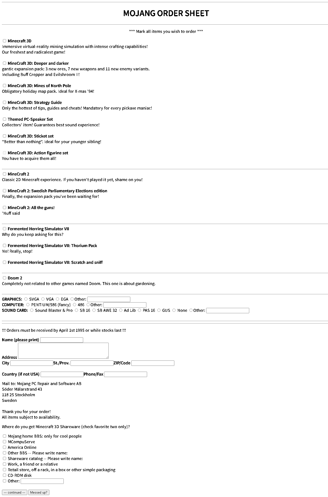
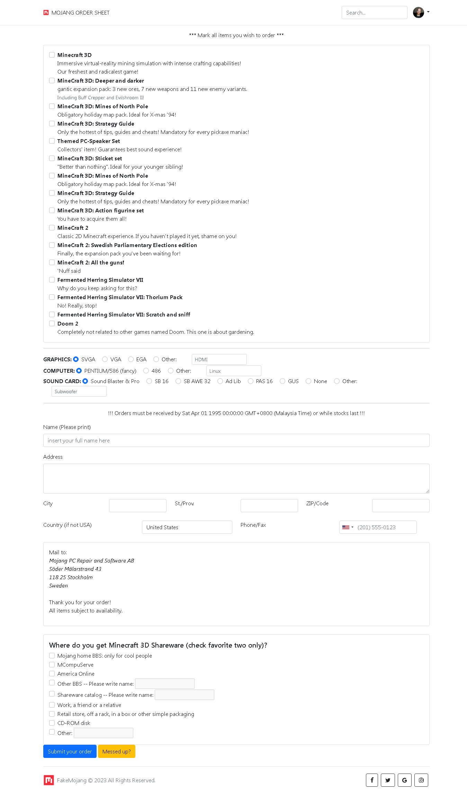


# 私人Project —— Mojang April Fool
- 以前第一次玩麦块的愚人节的时候，就是关于这个神奇的单子。
- 当时这个单子使用microsoft word抒写，这让我觉得有点简陋，因而激起我想要把他做成网页的念头。
- 那时候我就把它想办法写成一个可以用的纯净态网页，但是效果很烂：

- 于是在今天这个时间，我决定把这东西重新修改，采用了bootstrap5以及他的各种helper功能，外加jquery来重新设计整个网页，至少看起来比较舒服。

# 所使用的各种插件：
### CSS
- bootstrap5 —— 主要练习排版设计的好东西
  - bootstrap-formhelpers —— 核心选择器，主要运用在国家和城市的部分
- font-awesome 4.7.0 —— 当时练习的时候就用这个版本，我知道最新版已经到6代了。 ~~我就懒得升级怎样？~~
- intlTelInput —— 帮我处理了需要大量收集的电话格式的插件

### JS
- JQuery —— 核心JS，也是我目前最喜欢用的框架（或者说，最熟悉的）
- Utils —— TelInput所需元件
- checktwiceonly —— 自制JS，用来最下面只能选两个的验证器
- enabletyping —— 自制JS，如果用户选了指定checkbox，就会开放文字栏，否则清除文字并封锁文字栏

# 主要更动：
- 让按钮变得有用（functional）
- 采用bootstrap 5 设计来练习
- 国家和地区支援选择系统
- 电话支援选择系统
- 最底下的只能选两个功能已修复
- 只有选择的时候才能打开文字栏供人抒写
- 增加header和footer

# 目前进度：
- 静态：完成
- POST：还没动工
- 资料库：还没动工
- API：还没动工
